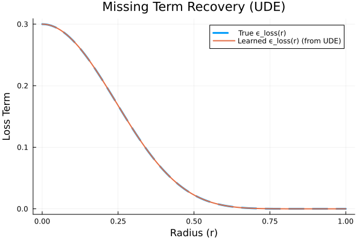

# Discovering Hidden Physics with Universal Differential Equations

This project uses Scientific Machine Learning (SciML) to discover a missing physical law in a simplified model of a star's energy equation.

## Project Goal

The primary goal is to demonstrate that a Universal Differential Equation (UDE), a type of physics-informed neural network, can accurately learn a hidden term in a known differential equation from data. Its performance is compared against a standard "black-box" Neural ODE to highlight the benefits of the physics-informed approach.

## Key Results

### 1. UDE Term Recovery
The UDE was able to learn the missing `ϵ_loss` term with near-perfect accuracy.



### 2. Final Model Comparison
The final comparison shows that the physics-informed UDE significantly outperforms the black-box Neural ODE, with its prediction being visually indistinguishable from the true physics.


### 3. Discovered Equation
Symbolic regression was used to analyze the trained UDE. It successfully discovered that the learned correction factor was a constant with a value of **`0.3`**, matching the true physical parameter `λ₀`.

## Analysis and Conclusion

The UDE's high accuracy stems from its hybrid structure; by incorporating known physics, it only needed to learn a simple missing component. In contrast, the black-box Neural ODE struggled because it had to learn the entire complex system from scratch.

This project demonstrates that combining existing scientific knowledge with machine learning is a far more powerful and scientifically useful approach than using machine learning as a pure black box.

## How to Run

1.  Make sure you have Julia installed.
2.  Clone this repository.
3.  Navigate to the project folder and run the following command in your terminal to install the necessary packages and run the pipeline:
    ```bash
    julia --project -e 'using Pkg; Pkg.instantiate(); include("run_pipeline.jl")'
    ```