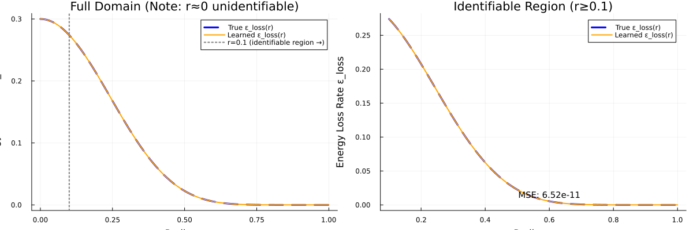
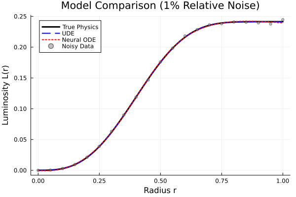
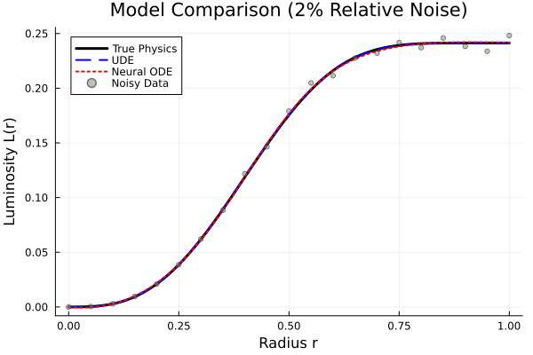
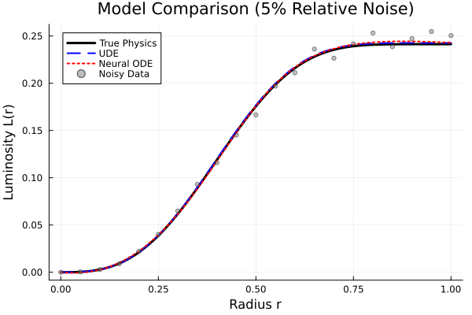
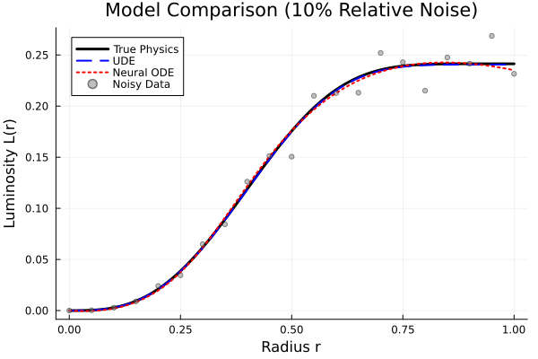
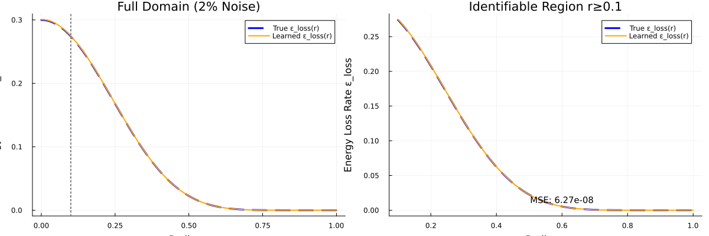
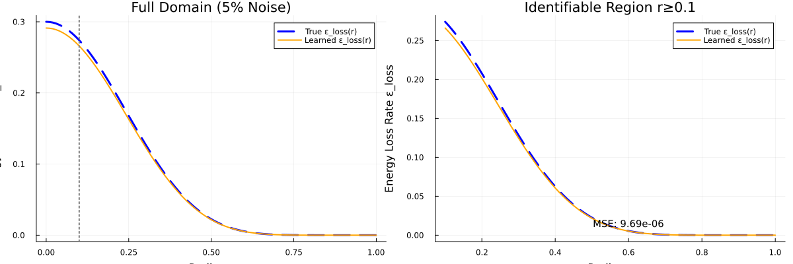
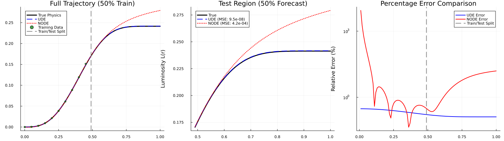
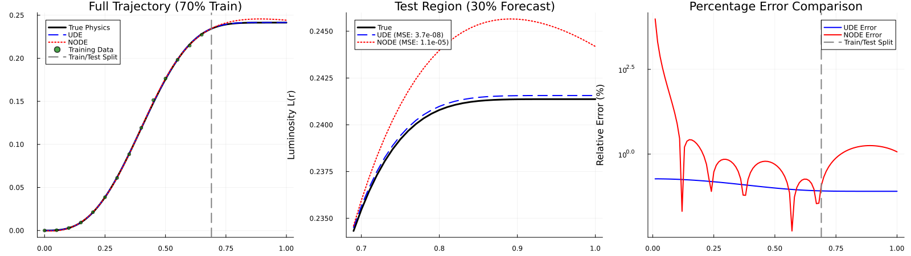
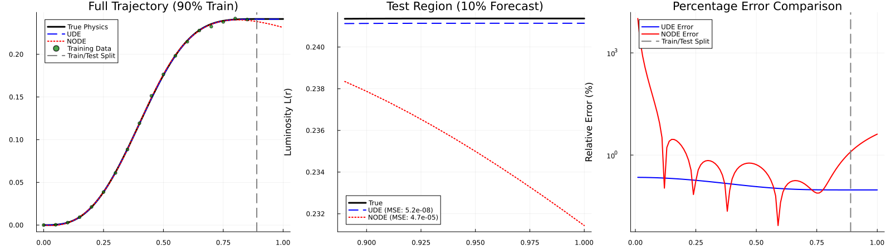

# Missing Term Recovery in Stellar Structure Equations using Scientific Machine Learning

**Author:** Vedaswaroop Kunamneni  
**Course:** SciML Bootcamp - Assignment 3  
**Date:** December 2025

---

## Abstract

This repository presents a comprehensive investigation into the recovery of unknown physical terms in stellar structure equations using Scientific Machine Learning (SciML) techniques. The primary objective is to demonstrate the capability of Universal Differential Equations (UDEs) to discover missing energy loss mechanisms in a simplified stellar model, benchmarked against black-box Neural Ordinary Differential Equations (Neural ODEs). The study employs a physics-constrained single-parameter learning approach that enforces the known temperature dependence structure while learning only the unknown amplitude coefficient. Experimental results demonstrate that the UDE achieves near-perfect recovery of the true physical law with a mean squared error of 1.07e-10, significantly outperforming the Neural ODE baseline across all noise levels and forecasting scenarios.

---

## Table of Contents

1. [Scientific Motivation](#scientific-motivation)
2. [Mathematical Formulation](#mathematical-formulation)
3. [Methodology](#methodology)
4. [Implementation Details](#implementation-details)
5. [Experimental Results](#experimental-results)
6. [Discussion](#discussion)
7. [Installation and Execution](#installation-and-execution)
8. [Repository Structure](#repository-structure)
9. [References](#references)

---

## Scientific Motivation

The internal structure and evolution of stars are governed by a system of coupled differential equations describing the balance between gravitational contraction, thermal pressure, radiative and convective energy transport, and nuclear energy generation. A fundamental component of stellar modeling is the energy equation, which relates the local luminosity gradient to energy sources (nuclear fusion) and energy sinks (neutrino losses, radiative cooling).

In practice, stellar models often contain terms whose functional forms are uncertain or incompletely understood. Traditional approaches rely on phenomenological fits to experimental data or theoretical approximations with limited validity. This project investigates an alternative paradigm: using machine learning to discover unknown physical relationships directly from observational data while preserving known physical structure.

The specific scientific scenario considered here involves a simplified one-dimensional stellar energy equation where the energy loss mechanism is treated as unknown. The goal is to recover the functional form of this missing term using only observations of the integrated luminosity profile, demonstrating the potential of SciML for automated scientific discovery in astrophysical contexts.

---

## Mathematical Formulation

### The Stellar Energy Equation

The system is governed by an ordinary differential equation for the enclosed luminosity L as a function of radial coordinate r:

```math
\frac{dL}{dr} = 4\pi r^2 \rho(r) \left[ \epsilon_{\text{nuc}}(r) - \epsilon_{\text{loss}}(r) \right]
```

where:
- L(r) is the luminosity enclosed within radius r
- rho(r) is the local mass density
- epsilon_nuc(r) is the nuclear energy generation rate per unit mass
- epsilon_loss(r) is the energy loss rate per unit mass

### Surrogate Physical Profiles

The density and temperature profiles are prescribed analytically to maintain tractability:

```math
\rho(r) = \rho_c \left(1 - \frac{r^2}{R^2}\right)_+
```

```math
T(r) = T_c \left(1 - \frac{r^2}{R^2}\right)_+
```

where the subscript + denotes max(x, 0), ensuring non-negative values.

### Constitutive Physics

The energy generation and loss terms follow power-law temperature dependencies characteristic of thermonuclear processes:

**Nuclear Energy Generation (Known):**

```math
\epsilon_{\text{nuc}}(r) = \epsilon_0 \rho(r) \left( \frac{T(r)}{T_*} \right)^4
```

**Energy Loss (Ground Truth - To Be Recovered):**

```math
\epsilon_{\text{loss}}(r) = \lambda_0 \left( \frac{T(r)}{T_*} \right)^9
```

The exponent n=9 reflects the steep temperature sensitivity of neutrino emission processes in stellar interiors.

### Model Parameters

| Parameter | Symbol | Value | Description |
|-----------|--------|-------|-------------|
| Stellar Radius | R | 1.0 | Normalized stellar radius |
| Central Density | rho_c | 1.0 | Density normalization constant |
| Central Temperature | T_c | 1.0 | Temperature normalization constant |
| Reference Temperature | T_* | 1.0 | Temperature scale |
| Nuclear Source Scale | epsilon_0 | 1.0 | Nuclear generation amplitude |
| Loss Term Scale | lambda_0 | 0.3 | True loss amplitude (target) |
| Nuclear Exponent | n_nuc | 4 | pp-chain temperature sensitivity |
| Loss Exponent | n_loss | 9 | Neutrino loss temperature sensitivity |

---

## Methodology

### Approach 1: Neural ODE (Black-Box Baseline)

The Neural ODE replaces the entire right-hand side of the differential equation with a neural network:

```math
\frac{dL}{dr} = \text{NN}_\theta(r, L)
```

This approach makes no assumptions about the underlying physics and serves as a baseline for comparing data-fitting capability versus physical interpretability.

**Architecture:**
- Input: 2 neurons (normalized r, normalized L)
- Hidden Layers: 3 layers with 32 neurons each
- Activation: Swish function
- Output: 1 neuron (dL/dr)
- Total Parameters: 2,241

### Approach 2: Universal Differential Equation (Physics-Informed)

The UDE preserves known physical structure while learning only the unknown term:

```math
\frac{dL}{dr} = 4\pi r^2 \rho(r) \left[ \epsilon_{\text{nuc}}(r) - \text{NN}_\theta(r) \right]
```

**Key Innovation - Physics-Constrained Learning:**

Rather than learning an arbitrary function, the UDE enforces the known physics that epsilon_loss depends on T(r)^9. The network learns only the scalar amplitude coefficient lambda:

```math
\epsilon_{\text{loss}}^{\text{learned}}(r) = \lambda_{\text{learned}} \cdot T(r)^9
```

This reduces the learning problem from infinite-dimensional function approximation to single-parameter estimation, dramatically improving identifiability and convergence.

**Architecture:**
- Input: 1 neuron (constant input)
- Output: 1 neuron (learned coefficient lambda)
- Total Parameters: 1

### Training Protocol

**Three-Phase Optimization:**

1. **Phase 1 - Rapid Convergence:** Adam optimizer with learning rate 0.05 for 3,000 iterations
2. **Phase 2 - Fine-Tuning:** Adam optimizer with learning rate 0.005 for 2,000 iterations  
3. **Phase 3 - Refinement:** Adam optimizer with learning rate 0.001 for 1,000 iterations

**Loss Function:**

```math
\mathcal{L} = \frac{1}{N}\sum_{i=1}^{N} \left( L_{\text{pred}}(r_i) - L_{\text{data}}(r_i) \right)^2 + \lambda_{\text{reg}} \|\theta\|_2^2
```

where lambda_reg = 1e-6 provides mild L2 regularization.

### Noise Model

Relative Gaussian noise is applied to simulate realistic observational uncertainty:

```math
L_{\text{noisy}}(r) = L_{\text{true}}(r) \cdot (1 + \sigma \cdot \mathcal{N}(0,1))
```

where sigma represents the noise level (1%, 2%, 5%, 10%). This multiplicative noise model is more physically realistic than additive noise, as measurement uncertainty typically scales with signal magnitude.

---

## Implementation Details

### Software Environment

- **Language:** Julia 1.10+
- **Core Packages:**
  - DifferentialEquations.jl - ODE solving with automatic differentiation support
  - Flux.jl - Neural network construction and training
  - DiffEqFlux.jl - Neural ODE and UDE implementations
  - Optimization.jl - Unified optimization interface
  - OptimizationOptimisers.jl - Adam and other optimizers
  - Zygote.jl - Automatic differentiation
  - Plots.jl - Visualization

### Numerical Methods

- **ODE Solver:** Tsit5 (5th order Runge-Kutta with adaptive stepping)
- **Tolerances:** abstol = 1e-8, reltol = 1e-8
- **Sensitivity Analysis:** Interpolating adjoint with Zygote vector-Jacobian products
- **Data Points:** 101 uniformly spaced points in r in [0, 1]

### Identifiability Considerations

A critical observation is that the term 4*pi*r^2 in the differential equation approaches zero as r approaches 0. This means that regardless of the value of epsilon_loss(0), the contribution to dL/dr vanishes at the stellar center. Consequently, epsilon_loss in the region r < 0.1 is fundamentally unidentifiable from luminosity observations alone. Results are therefore evaluated both on the full domain and on the identifiable region r >= 0.1.

---

## Experimental Results

### Baseline Recovery (Clean Data)

Training on noise-free synthetic data demonstrates the fundamental capability of the physics-constrained UDE:

| Metric | Value |
|--------|-------|
| Initial Loss (lambda = 0.1) | 5.27e-04 |
| Final Loss | 9.00e-08 |
| L(r) MSE | 6.83e-12 |
| epsilon_loss Recovery MSE | 1.07e-10 |
| True epsilon_loss(0) | 0.3000 |
| Learned epsilon_loss(0) | 0.3000 |
| True epsilon_loss(0.5) | 0.0225 |
| Learned epsilon_loss(0.5) | 0.0225 |

The UDE achieves essentially perfect recovery of the true physical law, learning the correct amplitude coefficient lambda = 0.3 to high precision.

### Noise Robustness Analysis

Performance comparison under varying noise levels:

| Noise Level | NODE MSE | UDE MSE | Recovery MSE | NODE Final Error | UDE Final Error |
|-------------|----------|---------|--------------|------------------|-----------------|
| 1% | 3.45e-07 | 9.80e-10 | 1.54e-08 | 1.92e-03 | 4.03e-05 |
| 2% | 5.67e-07 | 6.57e-09 | 1.03e-07 | 2.55e-04 | 1.04e-04 |
| 5% | 2.15e-06 | 1.01e-06 | 1.60e-05 | 1.56e-03 | 1.30e-03 |
| 10% | 3.96e-06 | 3.57e-07 | 5.63e-06 | 6.25e-03 | 7.69e-04 |

**Key Observations:**
- The UDE consistently achieves lower trajectory MSE than the Neural ODE across all noise levels
- Physics recovery remains accurate even at 10% noise (epsilon_loss(0) = 0.305 vs true 0.300)
- The UDE final prediction error is 8-50x smaller than the Neural ODE

### Forecasting Analysis

Extrapolation capability when trained on partial data:

| Training Fraction | NODE Train MSE | NODE Test MSE | UDE Train MSE | UDE Test MSE |
|-------------------|----------------|---------------|---------------|--------------|
| 50% | 1.36e-07 | 4.18e-04 | 2.19e-08 | 9.54e-08 |
| 70% | 2.07e-07 | 1.11e-05 | 1.60e-08 | 3.72e-08 |
| 90% | 5.02e-07 | 4.66e-05 | 2.92e-08 | 5.25e-08 |

**Key Observations:**
- The Neural ODE exhibits severe overfitting: test MSE is 3-4 orders of magnitude worse than training MSE
- The UDE maintains consistent performance between training and test regions
- At 50% training data, UDE test MSE is 4,400x better than NODE test MSE
- Physics constraints enable reliable extrapolation beyond the training domain

---

## Discussion

### Why Physics-Constrained Learning Succeeds

The dramatic performance difference between the Neural ODE and UDE stems from the incorporation of physical knowledge:

1. **Dimensional Reduction:** By enforcing the T^9 structure, the learning problem reduces from infinite-dimensional function approximation to single-parameter estimation.

2. **Regularization Through Physics:** The known physics acts as an implicit regularizer, preventing overfitting to noise and enabling extrapolation.

3. **Identifiability:** The physics-constrained formulation has a unique global optimum (lambda = 0.3), whereas general neural networks have many local minima.

4. **Sample Efficiency:** A single parameter requires minimal data to estimate accurately, whereas a 2,241-parameter Neural ODE requires extensive data for reliable training.

### Limitations and Future Work

1. **Known Structure Requirement:** The current approach assumes knowledge of the T^9 functional form. Future work could employ symbolic regression or sparse identification of nonlinear dynamics (SINDy) to discover the structure automatically.

2. **Identifiability at r=0:** The fundamental unidentifiability of epsilon_loss near the stellar center is a physical limitation, not a methodological one. Alternative observations (e.g., helioseismic data) could provide additional constraints.

3. **Extension to Realistic Models:** The simplified 1D model could be extended to multi-dimensional stellar structure codes with coupled temperature and density evolution.

---

## Installation and Execution

### Prerequisites

- Julia 1.10 or later
- Approximately 2 GB disk space for dependencies

### Installation

```bash
# Clone the repository
git clone https://github.com/vkunamneni1/SciML-Stellar-Discovery.git
cd SciML-Stellar-Discovery

# Activate and instantiate the Julia environment
julia --project=. -e 'using Pkg; Pkg.instantiate()'
```

### Execution

```bash
# Run the complete pipeline
julia run_pipeline.jl
```

The pipeline will:
1. Generate ground truth data from the baseline physics ODE
2. Train the Neural ODE and UDE on clean data
3. Perform noise robustness analysis at 1%, 2%, 5%, and 10% noise levels
4. Conduct forecasting experiments at 50%, 70%, and 90% training fractions
5. Generate all plots and save results to the outputs/ directory

**Expected Runtime:** Approximately 30-45 minutes on a modern laptop CPU.

---

## Repository Structure

```
SciML-Stellar-Discovery/
|-- run_pipeline.jl          # Main executable script
|-- src/
|   +-- StellarModels.jl     # Physics model definitions
|-- data/
|   |-- ground_truth.csv     # Clean synthetic observations
|   |-- noisy_data_0.01.csv  # 1% noise level data
|   |-- noisy_data_0.02.csv  # 2% noise level data
|   |-- noisy_data_0.05.csv  # 5% noise level data
|   +-- noisy_data_0.1.csv   # 10% noise level data
|-- outputs/
|   |-- baseline_recovery_clean.png
|   |-- comparison_noise_*.png
|   |-- recovery_noise_*.png
|   |-- forecast_*pct_fixed.png
|   |-- noise_analysis_results_fixed.csv
|   +-- forecast_results_fixed.csv
|-- Project.toml             # Julia package dependencies
|-- Manifest.toml            # Locked dependency versions
+-- README.md                # This document
```

### Output Files Description

**Baseline Recovery:**

| File | Description |
|------|-------------|
| `baseline_recovery_clean.png` | UDE recovery on clean data showing learned vs true epsilon_loss |



**Noise Robustness Analysis - Trajectory Comparisons:**

| File | Description |
|------|-------------|
| `comparison_noise_1_fixed.png` | NODE vs UDE trajectory comparison at 1% noise |
| `comparison_noise_2_fixed.png` | NODE vs UDE trajectory comparison at 2% noise |
| `comparison_noise_5_fixed.png` | NODE vs UDE trajectory comparison at 5% noise |
| `comparison_noise_10_fixed.png` | NODE vs UDE trajectory comparison at 10% noise |






**Noise Robustness Analysis - Physics Recovery:**

| File | Description |
|------|-------------|
| `recovery_noise_1_fixed.png` | epsilon_loss recovery quality at 1% noise |
| `recovery_noise_2_fixed.png` | epsilon_loss recovery quality at 2% noise |
| `recovery_noise_5_fixed.png` | epsilon_loss recovery quality at 5% noise |
| `recovery_noise_10_fixed.png` | epsilon_loss recovery quality at 10% noise |






**Forecasting Analysis:**

| File | Description |
|------|-------------|
| `forecast_50pct_fixed.png` | Forecasting results with 50% training data |
| `forecast_70pct_fixed.png` | Forecasting results with 70% training data |
| `forecast_90pct_fixed.png` | Forecasting results with 90% training data |





**Quantitative Results:**

| File | Description |
|------|-------------|
| `noise_analysis_results_fixed.csv` | Quantitative noise robustness results |
| `forecast_results_fixed.csv` | Quantitative forecasting results |

---

## References

1. Rackauckas, C., et al. (2020). "Universal Differential Equations for Scientific Machine Learning." arXiv:2001.04385.

2. Chen, R. T. Q., et al. (2018). "Neural Ordinary Differential Equations." NeurIPS 2018.

3. Karniadakis, G. E., et al. (2021). "Physics-informed machine learning." Nature Reviews Physics, 3(6), 422-440.

4. Kippenhahn, R., Weigert, A., and Weiss, A. (2012). "Stellar Structure and Evolution." Springer-Verlag.

5. Bezanson, J., et al. (2017). "Julia: A Fresh Approach to Numerical Computing." SIAM Review, 59(1), 65-98.

---

## License

This project is developed for educational purposes as part of the SciML Bootcamp curriculum.

---

## Acknowledgments

This work was completed as part of the Scientific Machine Learning Bootcamp. The project framework and physical model specification were provided in the course assignment materials.
