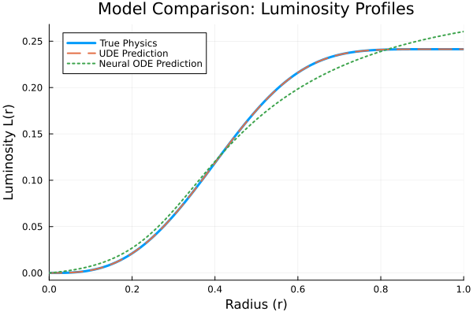

# Missing Term Recovery in Stellar Structure Equations

## Abstract

This project demonstrates the recovery of a missing physical **term** in a stellar energy toy model using a Universal Differential Equation (UDE). A physics-informed model, where a neural network learns only the unknown energy loss term, is benchmarked against a black-box Neural ODE. The trained UDE component is then distilled into a closed-form analytical expression via symbolic regression, successfully recovering the true underlying physical **term**.

---

## Methodology

The workflow consists of four stages:

#### 1. Baseline Model
A complete physics-based Ordinary Differential Equation (ODE) is solved to generate the ground-truth data for the star's luminosity profile, `L(r)`. This serves as the baseline for our experiment.


#### 2. Black-Box Model (Neural ODE)
A Neural ODE is trained on synthetic observational data to benchmark the performance of a purely data-driven approach.

#### 3. Physics-Informed Model (UDE)
A UDE is implemented where the known nuclear energy generation term is preserved, and a neural network (`NN(r, L)`) learns a correction factor for the missing energy loss term.

#### 4. Symbolic Discovery
Symbolic regression is applied to the UDE's trained neural network component to find its underlying mathematical formula.

---

## Key Results

#### 1. Model Performance Comparison
The physics-informed UDE demonstrates superior accuracy and adherence to the true physical dynamics compared to the black-box Neural ODE. The UDE's prediction is visually indistinguishable from the ground truth.



#### 2. Term Recovery & Symbolic Discovery
The UDE successfully learned the behavior of the missing energy loss term across the star's radius. Symbolic regression on the learned component correctly distilled its analytical form to a constant, matching the true physical parameter `λ₀ = 0.3`.


**Discovered Analytical Form for the Correction Factor:**
```
0.2999977...
```

---

## How to Reproduce

1.  Ensure you have Julia installed.
2.  Clone this repository.
3.  Navigate to the project folder and run the following command in your terminal. This will install the necessary packages and execute the entire pipeline:
    ```bash
    julia --project -e 'using Pkg; Pkg.instantiate(); include("run_pipeline.jl")'
    ```